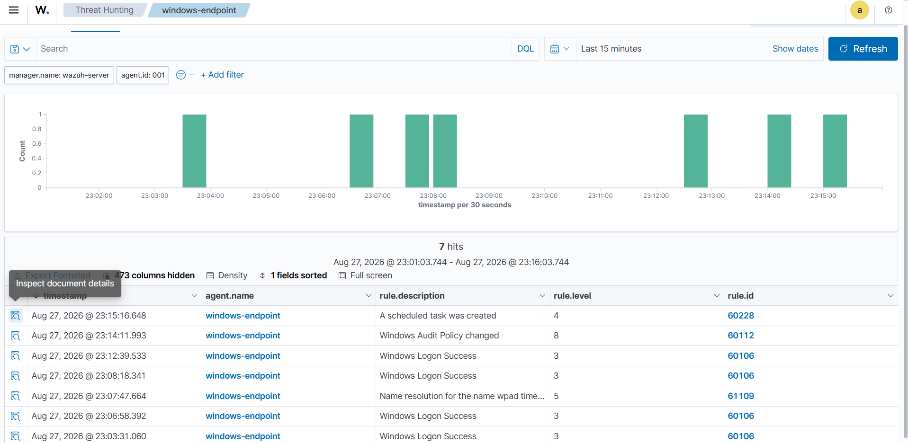
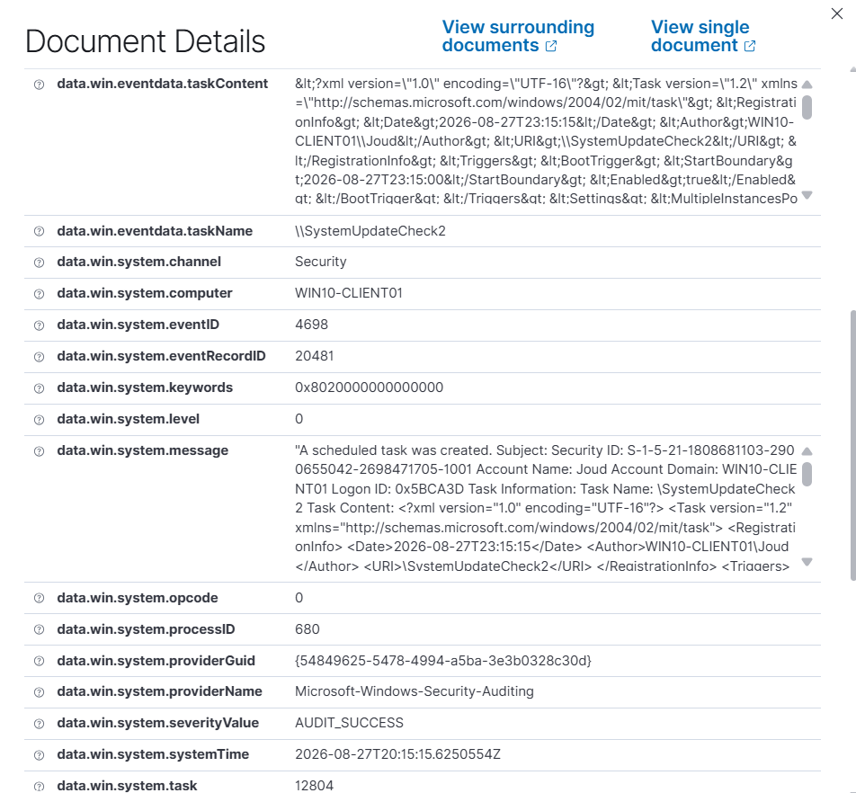
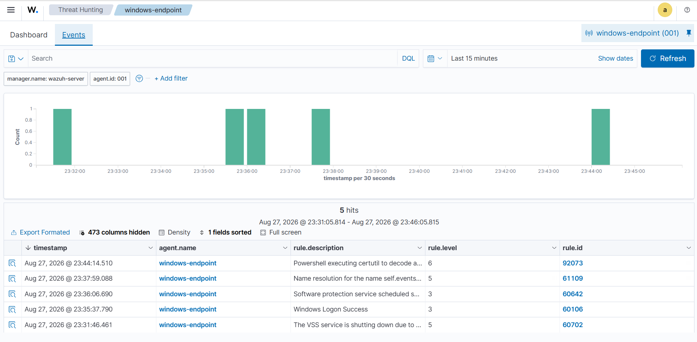
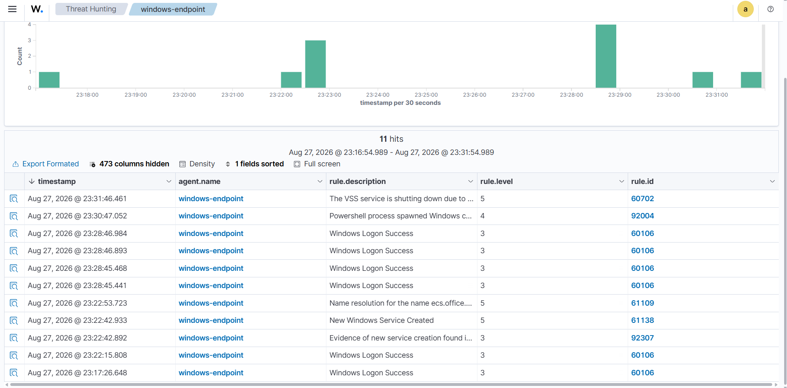
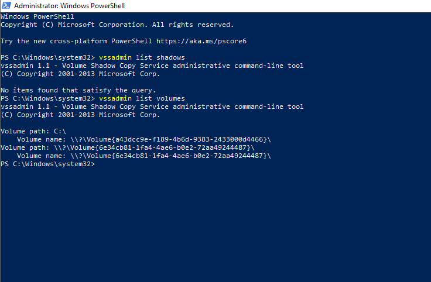

# Incident Response Playbook: Living-off-the-Land Persistence Chain

A constructed multi-stage intrusion scenario, built from four techniques I tested individually in the [SOC Home Lab project](./README.md), connected into one narrative to document how I'd walk through an incident response cycle end-to-end — following the NIST Incident Response Lifecycle.

## Purpose

The SOC Home Lab project tested detection coverage for six techniques in isolation, each on its own. This playbook takes four of those and links them into a single realistic attack chain, so I could practice the response process itself — identification, containment, eradication, recovery — not just the detection side.

**A note on the scenario:** This is a constructed narrative, not a live multi-stage attack I ran in one continuous session. The four techniques were each tested separately as part of the original lab work; here I've sequenced them into a plausible attack chain and documented the response I'd take at each stage. The technical evidence (rule IDs, detection results, command output) is all real and drawn directly from that testing — only the "connected incident" framing is constructed for this exercise.

## Scenario Summary

A simulated adversary, assumed to already have a foothold on the endpoint (initial access is out of scope here), performs the following chain of actions to establish persistence, evade detection, and scope out further compromise:

| Stage | ATT&CK Tactic | Technique | MITRE ID |
|---|---|---|---|
| 1 | Persistence | Scheduled Task (ONSTART, SYSTEM) | T1053.005 |
| 2 | Defense Evasion | Alternate Data Streams | T1564.004 |
| 3 | Defense Evasion | CertUtil Decode (LOLBIN) | T1140 |
| 4 | Discovery | Volume Shadow Copy Inspection | T1003.002-adjacent (assessment only, not executed) |

---

## NIST Incident Response Lifecycle

### 1. Preparation

*(In place before the incident — the baseline this response relies on.)*

- Wazuh SIEM deployed and actively monitoring the Windows 10 endpoint
- Sysmon installed with the SwiftOnSecurity configuration for process/file/registry telemetry
- Windows Advanced Audit Policy configured to log Scheduled Task and Object Access events
- Baseline knowledge of normal endpoint behavior (no scheduled tasks, no unusual services, no unexplained files in `C:\Users\Public`)

---

### 2. Identification

**Trigger alert:**

- Rule 60228 — "A scheduled task was created"
- Task Name: `SystemUpdateCheck`
- Run As: SYSTEM
- Trigger: ONSTART
- Level: 4

*Note: this alert fired on `SystemUpdateCheck2`, created after the audit policy fix. The original task went unlogged — see the SOC Home Lab README for the full root-cause analysis.*




**Verification checklist:**

| Question | Finding | Assessment |
|---|---|---|
| Where does it run from? | `C:\Windows\System32\notepad.exe` — path itself is legitimate, but paired with a task name suggesting a Windows Update process | Suspicious naming (masquerading) |
| When does it trigger? | On every system startup (ONSTART) | Consistent with persistence behavior |
| Under what privilege? | SYSTEM — the highest privilege level on the host | Disproportionate for a task named "update check" |
| Is it authorized? | No matching change request or maintenance record | No authorization found |

**Decision:** Treat as True Positive. The privilege level paired with no authorization on record is enough to escalate on its own — I didn't need confirmed malicious payload execution to justify that, since a preponderance of suspicious indicators is a reasonable basis to act on.

**Building the fuller picture:** For this exercise, I connected this task creation to three other techniques I'd tested separately in the same lab, to walk through how they'd read as a single incident if seen together on one host:

- Rule 92307 — Evidence pointing to Alternate Data Stream usage in `C:\Users\Public\report.txt`
- Rule 92073 — Powershell executing certutil to decode a file (Level 6, MITRE T1140)
- `vssadmin` activity — shadow copy enumeration commands

Framed together, this reads as a persistence attempt (the task) paired with two separate defense-evasion techniques (ADS, CertUtil) and a discovery step checking for a path to credential material (VSS) — a coherent intrusion pattern rather than one isolated event.



---

### 3. Containment

These are the containment steps I'd take based on this scenario. I didn't execute all of them live in the lab — some assume a real incident context, not the controlled testing I actually did.

- Isolate the host from the network to prevent lateral movement or C2 communication (in a live incident; in this lab, this would mean disconnecting the VM's virtual network adapter)
- Disable the scheduled task without deleting it yet, to preserve it for forensic review:
           schtasks /change /tn "SystemUpdateCheck" /disable

- Preserve the file with the hidden ADS stream rather than deleting it immediately — extract the stream content first as evidence:
Get-Item -Path C:\Users\Public\report.txt -Stream hidden
  


- If a certutil-related process were still running, avoid killing it immediately — capture process details first (PID, parent process, command line) for the investigation record

---

### 4. Eradication

Once evidence is preserved, remove the artifacts:

```powershell
# Remove the scheduled task
schtasks /delete /tn "SystemUpdateCheck" /f

# Remove the file containing the hidden ADS payload
Remove-Item C:\Users\Public\report.txt -Force

# Remove any encoded/decoded payload artifacts from the certutil activity
Remove-Item C:\Users\Public\payload*.txt -Force
```

Check for additional persistence in commonly abused locations before considering the host clean:

```powershell
Get-ItemProperty -Path "HKCU:\Software\Microsoft\Windows\CurrentVersion\Run"
schtasks /query /fo LIST | Select-String "SYSTEM"
sc.exe query state= all | Select-String -Context 0,2 "SERVICE_NAME"
```

---

### 5. Recovery

- Re-enable network connectivity once confirmed no active malicious processes remain
- Re-run the Wazuh FIM (Syscheck) scan to refresh the file integrity baseline
- Monitor the endpoint for 24–48 hours post-incident for recurrence of the same indicators
- Confirm with the system owner that containment didn't disrupt any legitimate process

---

### 6. Lessons Learned

| Gap Identified | Root Cause | Recommendation |
|---|---|---|
| Scheduled Task creation wasn't logged until fixed | Advanced Audit Policy subcategory disabled by default | Enable "Other Object Access Events" auditing as a standard hardening baseline, not a reactive fix |
| ADS activity wasn't detected by any layer tested | No native SIEM or Sysmon coverage for NTFS alternate data streams | Run the custom PowerShell ADS-detection script (see SOC Home Lab README) as a scheduled recurring scan |
| Registry Run key persistence also went undetected (tested separately, not part of this chain) | FIM doesn't monitor `HKCU\...\Run` by default | Add this path explicitly to the Wazuh `<syscheck>` configuration |
| No shadow copies existed on the host | System Protection / VSS not enabled | Enable System Protection as a baseline control — helps both backup posture and forensic recovery options |



**Takeaway:** Each of these gaps is manageable when looked at on its own. Sequenced together into one incident, though, they'd let an attacker persist, hide, and scope out further access without a single automatic alert along most of the chain — only the scheduled task (after remediation) and the CertUtil step would have triggered anything. That gap between "individually explainable" and "collectively serious" is the main reason I think chained scenarios like this are worth building, not just single-technique tests.

---

## Attack Narrative (Consolidated)

This sequences the four techniques as a plausible single incident, using the real detection results from each. It's a narrative construction, not a literal timeline from one continuous test session.

| Step | Action | Rule ID | Level | Detected? |
|---|---|---|---|---|
| 1 | Scheduled Task created (`SystemUpdateCheck`) | — | — | No, initially |
| 1b | (after audit policy fix) Second task created (`SystemUpdateCheck2`) | 60228 | 4 | Yes |
| 1c | Audit policy change itself flagged | 60112 | 8 | Yes |
| 2 | ADS payload hidden in `report.txt` | — | — | No |
| 3 | CertUtil used to decode payload via PowerShell | 92073 | 6 | Yes |
| 4 | VSS enumeration commands run (assessment only) | — | — | N/A — no shadow copies existed |

---

*This playbook is a companion to the SOC Home Lab project. All commands, rule IDs, and detection outcomes referenced here come directly from that project's testing.*
