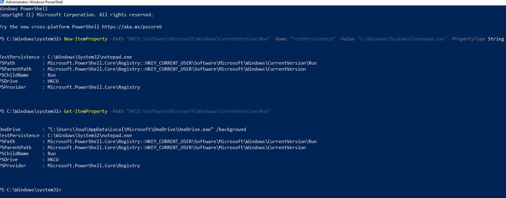
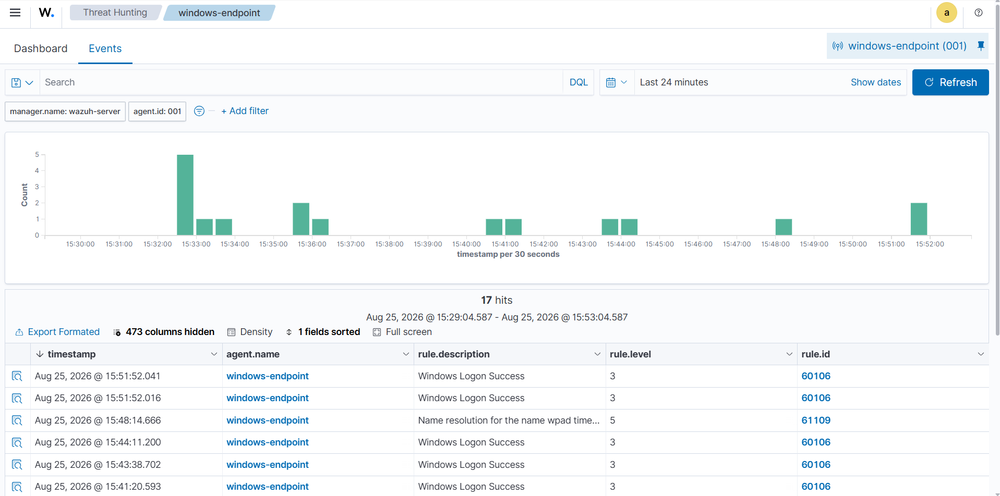
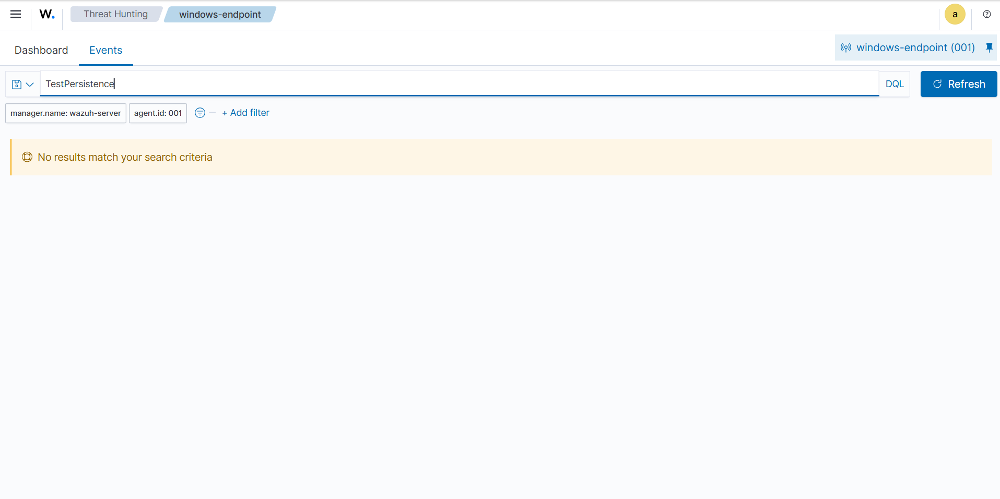
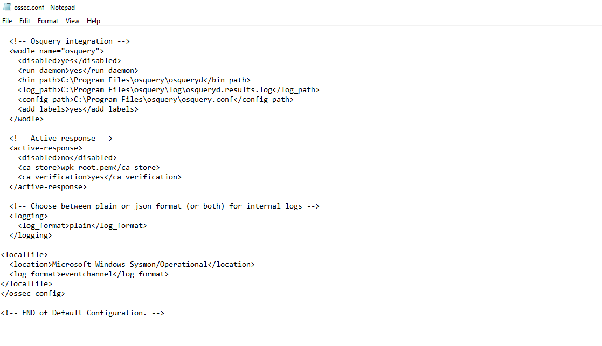
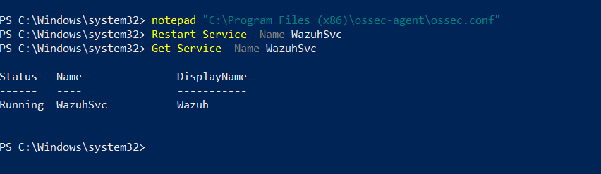
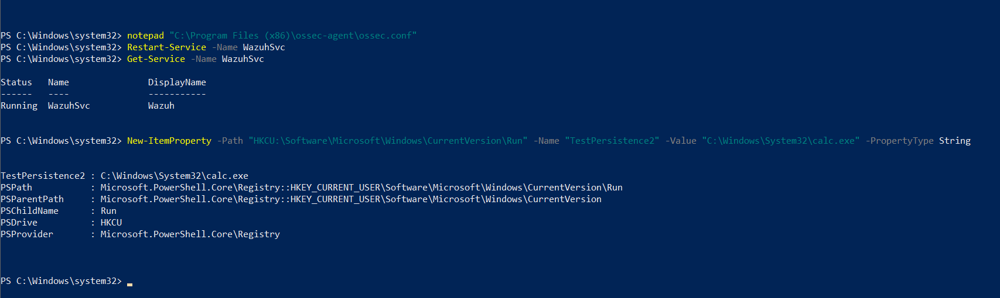
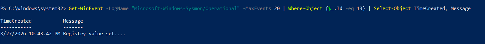
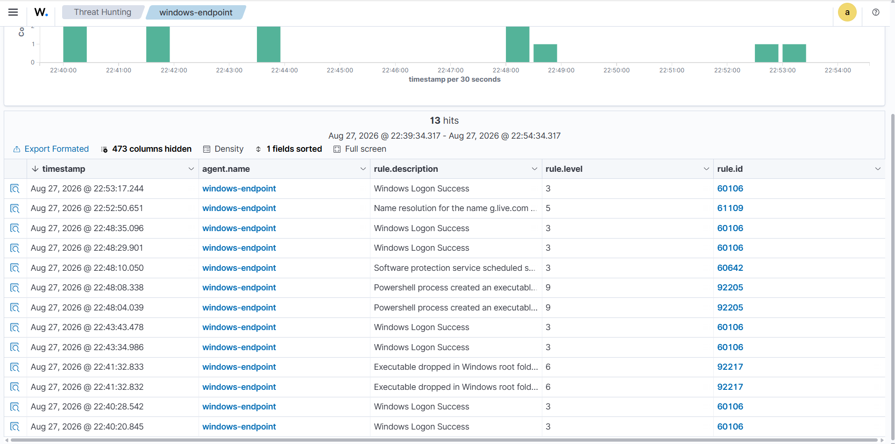
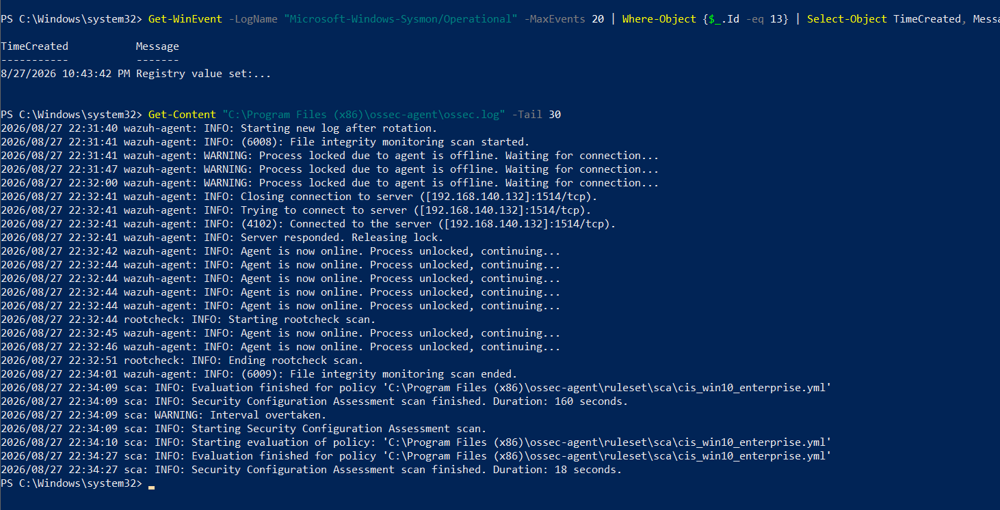

# Windows Persistence & LOLBIN Techniques: Simulation, Detection & Documentation

A hands-on SOC (Security Operations Center) home lab project. I built a SIEM environment from scratch, simulated five real-world adversary techniques mapped to MITRE ATT&CK, ran one credential-access precondition assessment, and documented what got detected, what didn't, why, and how I closed the gaps I could.

## Overview

I built this to move past theory. Instead of following a pre-built training lab, I built the entire environment myself — SIEM server, monitored endpoint, and monitoring stack — then used it to simulate attacker behavior and see what my setup actually caught.

**Goal:** Deploy a working SIEM, generate attacker-style activity on a monitored endpoint, and document — with evidence — what was detected, what wasn't, why, and what I did about it.

## Lab Architecture

| Component | Role | Details |
|---|---|---|
| Wazuh Server | Central SIEM (Manager + Indexer + Dashboard) | Ubuntu Server 26.04 LTS VM, deployed via VMware Workstation |
| Windows 10 Endpoint | Monitored client | Windows 10 Pro VM, connected via Wazuh Agent |
| Sysmon | Endpoint telemetry | Installed with the [SwiftOnSecurity Sysmon configuration](https://github.com/SwiftOnSecurity/sysmon-config) |

**Network:** Both VMs run on the same virtual network (NAT), communicating over the Wazuh Agent protocol (port 1514) and HTTPS dashboard access (port 443).

## Setup Summary

1. Provisioned an Ubuntu Server VM and installed Wazuh (Manager, Indexer, Dashboard) via the official install script
2. Provisioned a Windows 10 VM as the monitored endpoint
3. Installed Sysmon on the endpoint using the SwiftOnSecurity config linked above
4. Deployed the Wazuh Agent (MSI) on the endpoint and connected it to the Wazuh Manager
5. Verified agent connectivity (Active status) via the Wazuh dashboard
6. Extended the default agent configuration (`ossec.conf`) to forward Sysmon event logs to Wazuh
7. Simulated five MITRE ATT&CK-mapped techniques, plus one credential-access precondition check, and analyzed the results

## Detection Summary

Quick reference before the full write-up below.

| Technique | MITRE ID | Initial Detection | Remediation | Final Result |
|---|---|---|---|---|
| Registry Run Key | T1547.001 | ❌ | — (gap documented, not fixed) | ❌ |
| Scheduled Task | T1053.005 | ❌ | Enabled audit policy | ✅ |
| Fake Service | T1543.003 | ✅ | — | ✅ |
| Alternate Data Streams | T1564.004 | ❌ | Custom PowerShell script | ⚠️ Manual detection only |
| CertUtil (LOLBIN) | T1140 | ✅ | — | ✅ |
| VSS Inspection | T1003.002-adjacent | N/A (assessment, not execution) | — | N/A |

## Techniques Simulated

Each technique below was executed manually on the endpoint, then checked against the Wazuh dashboard to see whether — and how — it was detected.

---

### 1. Registry Persistence (Run Key)

**MITRE ATT&CK:** T1547.001 – Boot or Logon Autostart Execution: Registry Run Keys

**Description:** Adding an entry to `HKCU\Software\Microsoft\Windows\CurrentVersion\Run` makes a payload run automatically on every user logon — a simple, common persistence method.

**Command executed:**
```powershell
New-ItemProperty -Path "HKCU:\Software\Microsoft\Windows\CurrentVersion\Run" -Name "TestPersistence" -Value "C:\Windows\System32\notepad.exe" -PropertyType String
```

**Detection Result:** Not detected by any correlation rule.

**Analysis:** Sysmon logged the registry change locally (Event ID 13 – RegistryEvent), so the sensor itself worked. But nothing showed up in Wazuh's Threat Hunting view under a dedicated rule. Wazuh's File Integrity Monitoring (FIM/Syscheck) module does actively watch some registry paths by default (e.g. `HKEY_LOCAL_MACHINE\System\CurrentControlSet\Services`), but `HKCU\...\Run` isn't one of them, and there was no correlation rule set up to surface raw Sysmon Event ID 13 data on its own.

**Conclusion:** This is a real gap in my default configuration, not a broken tool. Sysmon captured the right telemetry — the SIEM just wasn't configured to do anything with it for this specific path. I left this one undetected rather than patching it, so I'd have at least one documented gap that wasn't "fixed" — a more honest picture of where the setup stands.


<details>
<summary><b>Evidence (9 screenshots)</b></summary>

**Run key created and verified**


**Wazuh receiving events from the endpoint in the same window**


**Searching for the value name returns nothing**


**Sysmon channel added to the agent configuration**


**Agent service restarted**


**Technique re-executed with a second value**


**Sysmon Event ID 13 confirms the write was logged locally**


**Still no dedicated registry alert after re-testing**


**Agent log confirms connectivity and healthy scans**


</details>
---

### 2. Scheduled Task Abuse (ONSTART Trigger)

**MITRE ATT&CK:** T1053.005 – Scheduled Task/Job: Scheduled Task

**Description:** A scheduled task set to run at startup under the SYSTEM account is a common way to persist and hold onto elevated privileges. I gave the task a name meant to look like a legitimate system process — the same kind of masquerading real attackers use.

**Command executed:**
```powershell
schtasks /create /tn "SystemUpdateCheck" /tr "C:\Windows\System32\notepad.exe" /sc ONSTART /ru SYSTEM /f
```

**Detection Result:** Not detected initially → detected after remediation.

**Root Cause Analysis:** Windows only writes Scheduled Task creation events (Event ID 4698) to the Security log if the relevant Advanced Audit Policy subcategory is turned on. That subcategory ("Other Object Access Events") is disabled by default on a standalone Windows install, so the event was never logged in the first place — this had nothing to do with the SIEM at all.

**Remediation applied:**
```powershell
auditpol /set /subcategory:"Other Object Access Events" /success:enable /failure:enable
```

**Verification:** I created a second task (`SystemUpdateCheck2`) after enabling the audit policy, and it was caught right away:
- Rule 60228 – "A scheduled task was created" (Level 4)
- Rule 60112 – "Windows Audit Policy changed" (Level 8) — Wazuh also flagged the audit policy change itself

**Conclusion:** This demonstrated a complete detection engineering cycle: simulate, find the gap, trace it to a root cause, apply a fix, and confirm the fix actually closed the gap.

---

### 3. Fake/Suspicious Service Creation

**MITRE ATT&CK:** T1543.003 – Create or Modify System Process: Windows Service

**Description:** Attackers often create Windows services with names that impersonate legitimate ones, while the actual binary path points somewhere else entirely. It's a masquerading technique — the goal is to blend into normal system administration activity.

**Command executed:**
```powershell
sc.exe create WindowsUpdateHelper binPath= "C:\Windows\System32\notepad.exe" start= demand
```

**Detection Result:** Detected immediately, no configuration changes needed.

**Analysis:** Unlike Scheduled Tasks, Windows Service creation is logged to the System event log by default — no audit policy dependency. Wazuh picked it up out of the box:
- Rule 61138 – "New Windows Service Created" (Level 5)
- Rule 92307 – "Evidence of new service creation found" (Level 3)

**Conclusion:** Useful contrast to Technique #2 — default Windows logging visibility depends heavily on the event category, not just whether Sysmon or the SIEM is running.

---

### 4. Alternate Data Streams (ADS) — Defense Evasion

**MITRE ATT&CK:** T1564.004 – Hide Artifacts: NTFS File Attributes

**Description:** NTFS lets a file carry hidden secondary data streams — content that doesn't show up through normal file browsing or a standard `dir`/Explorer view. It's a way to hide a payload inside what looks like an ordinary file.

**Commands executed:**
```powershell
echo "This is a normal file" > C:\Users\Public\report.txt
cmd /c "echo Hidden malicious payload data > C:\Users\Public\report.txt:hidden"
```

**Detection Result:** Not detected. Confirmed locally with `Get-Item -Path report.txt -Stream *`, which showed both the `:$DATA` and `:hidden` streams existed — but nothing showed up in Wazuh across an extended time window.

**Analysis:** In this lab's configuration, neither the default FIM setup nor the Sysmon config I used provided any visibility into NTFS alternate data streams. I'm not claiming this holds for every SIEM deployment — just for what I built and tested here.

**Compensating control I built:** Since there was no automatic detection available, I wrote a PowerShell script to check for hidden streams manually:
```powershell
Get-ChildItem -Path C:\Users\Public -Recurse | Get-Item -Stream * | Where-Object {$_.Stream -ne ':$DATA'}
```
It successfully found the hidden `report.txt:hidden` stream. It's not automatic detection, but it can be run on a schedule to provide periodic coverage where real-time visibility isn't available.

**Conclusion:** SIEM tools have blind spots by design, and this is one I could confirm directly. Where native detection wasn't there, I built something that at least closes the gap manually.

---

### 5. CertUtil Abuse (LOLBIN Simulation)

**MITRE ATT&CK:** T1140 – Deobfuscate/Decode Files or Information

**Description:** `certutil.exe` is a legitimate, Microsoft-signed binary meant for certificate management. Its `-encode`/`-decode` functionality can also be abused to obfuscate and reconstruct a payload — a "living off the land" technique (LOLBIN), since it uses a trusted, pre-installed tool instead of dropping anything new.

**Commands executed:**
```powershell
"This is a harmless test payload" | Out-File C:\Users\Public\payload.txt
certutil -encode C:\Users\Public\payload.txt C:\Users\Public\payload_encoded.txt
certutil -decode C:\Users\Public\payload_encoded.txt C:\Users\Public\payload_decoded.txt
```

**Detection Result:** Detected immediately, with full context.

**Detection details:**
- Rule 92073 – "Powershell executing certutil to decode a file" (Level 6)
- Automatic MITRE mapping: T1140, Tactic: Defense Evasion, Technique: Deobfuscate/Decode Files or Information
- Full process lineage captured: `powershell.exe` (parent) → `certutil.exe` (child), including the exact command line, the user (`WIN10-CLIENT01\Joud`), and process integrity level (High)

**Conclusion:** This gave the most useful triage context of everything I tested — process lineage, command line, user, and integrity level all captured automatically, without me having to dig for it.

---

### 6. Volume Shadow Copy Inspection — Precondition Assessment for Credential Access

**Related MITRE ATT&CK technique:** T1003.002 – OS Credential Dumping: Security Account Manager

**Important note:** I did not execute T1003.002. Credential dumping via VSS requires access to an *existing* shadow copy to reach normally-locked files like the SAM database. This step only checked whether that precondition existed on the host — no credential extraction was attempted.

**Commands executed:**
```powershell
vssadmin list shadows
vssadmin list volumes
```

**Result:** No shadow copies existed on the system at the time of testing.

**Analysis:** No local Volume Shadow Copies were available as a recovery source at the time of testing. This means the specific VSS-to-SAM access path wasn't viable against this host in its current state — an attacker would need to wait for, or force, snapshot creation first. It also points to a potential recovery gap worth checking against whatever other backup mechanisms might be in place, rather than assuming there's no backup capability at all.

**Conclusion:** Even without an executable exploit path, this kind of check has real value in an assessment — it tells you both what's *not* currently possible, and what's worth flagging for the defensive side (e.g., enabling System Protection).

---

## What I Learned

- Telemetry existing isn't the same as detection existing — Sysmon logging an event locally doesn't mean the SIEM will surface it
- Default SIEM rules don't automatically cover every high-value location; FIM paths and correlation rules have to be deliberately configured
- Windows' own audit policy settings directly gate what even shows up in the event log, before the SIEM ever sees it
- When something doesn't get detected, the first step is checking the endpoint itself (did Sysmon even log it?) before assuming the SIEM is at fault
- When there's no native detection available, a manual or scheduled compensating control is still better than no coverage at all

## Tools Used

| Tool | Purpose |
|---|---|
| Wazuh 4.9.2 | SIEM (Manager, Indexer, Dashboard) |
| Sysmon (SwiftOnSecurity config) | Endpoint telemetry |
| VMware Workstation | Virtualization platform |
| Ubuntu Server 26.04 LTS | SIEM host OS |
| Windows 10 Pro | Monitored endpoint OS |
| PowerShell / CMD | Technique simulation and custom detection scripting |

## Possible Future Improvements

- Add a dedicated Wazuh custom rule for Registry Run Key changes (Event ID 13) to close the Technique #1 gap
- Schedule the ADS-detection PowerShell script as a recurring Wazuh-integrated task
- Extend the Sysmon configuration to explicitly cover more registry paths
- Build a full Incident Response Playbook connecting multiple techniques into one simulated intrusion scenario
